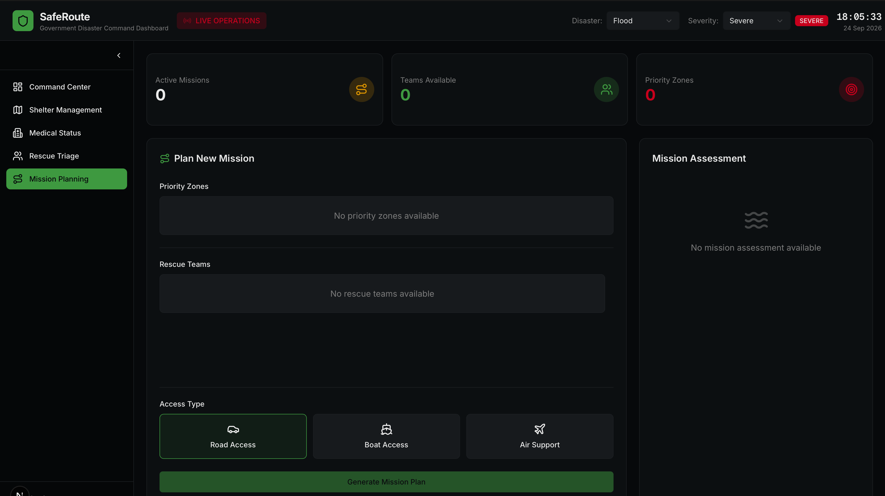
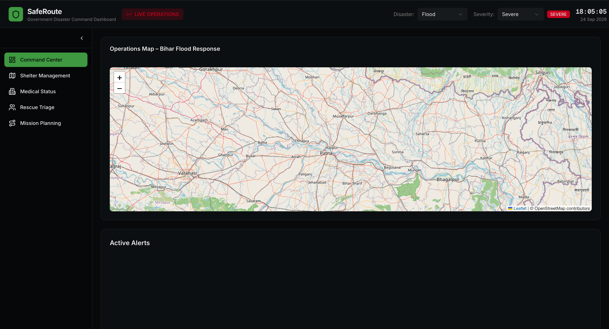

<div align="center">

# SafeRoute — Government Command Dashboard

### From Emergency Calls to Coordinated Rescue

**A disaster-response command interface designed to help authorities quickly understand emergency situations, prioritize survivors, plan rescue missions, and coordinate response teams.**

<br>

<a href="https://github.com/Dominic-leo-10/SafeRoute-Intelligent-Emergency-Shelter-and-Safe-Navigation-System">
  
</a>

<br><br>

</div>

---

# The Problem

During a disaster, the challenge is not only getting a survivor to safety.

It is also answering:

> **Who needs help first?**  
> **Where are they?**  
> **How severe is the situation?**  
> **Which rescue team should respond?**  
> **What is the fastest way to reach them?**

When emergency calls, SOS signals, survivor locations, shelter information, and field conditions begin arriving simultaneously, responders need more than individual alerts.

They need a **clear operational picture**.

That is where the SafeRoute Government Dashboard comes in.

---

# What is SafeRoute Government Dashboard?

The **SafeRoute Government Dashboard** is the command and coordination interface of the broader SafeRoute emergency-response system.

While the survivor-facing application focuses on:

> **"How do I get to safety?"**

the government dashboard focuses on:

> **"Who needs help, where are they, and how should we respond?"**

The dashboard is designed to help emergency authorities:

- Monitor incoming emergency situations
- Identify and prioritize survivors
- Understand disaster severity
- Locate emergency zones geographically
- Monitor available rescue teams
- Assess rescue requirements
- Plan response missions
- Select appropriate access methods
- Coordinate emergency operations
- Quickly transform emergency information into an actionable rescue plan

---

# From SOS to Rescue

The broader SafeRoute concept connects the survivor and government sides into a single emergency-response workflow.

```text
                SURVIVOR
                   │
                   │ SOS / Emergency
                   │ Location / Status
                   ▼
          ┌─────────────────┐
          │ COMMUNICATION   │
          │     LAYER       │
          └────────┬────────┘
                   │
                   ▼
          ┌─────────────────┐
          │ SAFE ROUTE      │
          │ BACKEND         │
          └────────┬────────┘
                   │
                   ▼
       ┌──────────────────────────┐
       │ GOVERNMENT COMMAND       │
       │ DASHBOARD                │
       └────────────┬─────────────┘
                    │
          ┌─────────┼─────────┐
          │         │         │
          ▼         ▼         ▼
       PRIORITY   RESCUE    SHELTER
        ZONES     TEAMS     STATUS
          │         │         │
          └─────────┼─────────┘
                    ▼
             MISSION PLANNING
                    │
                    ▼
             RESPONSE TEAM
                    │
                    ▼
                 RESCUE
```

The objective is to reduce the distance between:

**Emergency → Understanding → Decision → Response**

---

# Command Center

The Command Center provides the operational overview of the current disaster.

<p align="center">
  
</p>

The dashboard brings together critical information such as:

- Active missions
- Available rescue teams
- Priority zones
- Disaster type
- Severity
- Emergency alerts
- Geographic situation

The goal is to let response teams **grasp the situation quickly without moving between disconnected systems**.

---

# 🗺️ Operations Map

The Operations Map provides geographic context for the emergency.

<p align="center">
  
</p>

A disaster is not just a collection of numbers.

It happens somewhere.

The map allows responders to understand the geographical relationship between:

- Emergency locations
- Survivors
- Priority zones
- Shelters
- Rescue operations
- Disaster-affected regions

The mapping layer is powered by **Leaflet**.

---

# 🚨 Emergency Prioritization

Not every emergency can necessarily be handled at the same time.

When multiple survivors require assistance, the response system needs a way to determine:

> **Who requires immediate attention?**

SafeRoute's government-side architecture is designed around prioritization.

Emergency information can be used to identify:

- Severity
- Location
- Number of survivors
- Emergency status
- Accessibility
- Available response resources
- Priority zones

This creates a structured path from incoming emergency information to response planning.

```text
Emergency Calls
      │
      ▼
Situation Assessment
      │
      ▼
Priority Identification
      │
      ▼
Priority Zones
      │
      ▼
Mission Planning
      │
      ▼
Rescue Deployment
```

---

# 🎯 Priority Zones

Priority zones allow responders to identify areas requiring immediate attention.

The dashboard surfaces priority information directly inside the operational interface rather than forcing responders to search through individual records.

This helps answer:

> **Where should our attention go first?**

Priority information can then feed into mission planning and resource allocation.

---

# 🚑 Rescue Team Coordination

Emergency response requires more than knowing where survivors are.

Responders also need to know:

> **Which teams are available to respond?**

The Government Dashboard provides a dedicated view for rescue-team availability and mission planning.

The system is designed to connect:

```text
Emergency Location
        │
        ▼
Priority Assessment
        │
        ▼
Available Rescue Teams
        │
        ▼
Mission Planning
        │
        ▼
Response Deployment
```

This allows the command center to move from **awareness to action**.

---

# 🧭 Smart Mission Planning

One of the central capabilities of the dashboard is mission planning.

The mission planner brings together:

- Priority zones
- Rescue teams
- Mission assessment
- Access type
- Response requirements

The responder can then prepare a mission based on the available information.

---

## Access Types

Different disaster environments may require different methods of reaching an affected area.

The dashboard provides multiple access modes:

```text
┌──────────────────┐
│   ROAD ACCESS    │
│       🚑         │
└──────────────────┘

┌──────────────────┐
│   BOAT ACCESS    │
│       🚤         │
└──────────────────┘

┌──────────────────┐
│   AIR SUPPORT    │
│       ✈️         │
└──────────────────┘
```

This allows the response plan to account for the physical conditions of the affected area.

For example:

**Flooded region → Boat access**

**Accessible road network → Road response**

**Severely isolated region → Air support**

The system is designed to make the response plan reflect the actual environment rather than applying a single rescue method everywhere.

---

# 🧠 Mission Assessment

Before launching a response mission, the dashboard provides a dedicated assessment area.

The purpose is to bring together:

```text
Severity
   +
Priority
   +
Location
   +
Available Teams
   +
Access Method
   ↓
MISSION PLAN
```

The result is intended to give responders a clearer understanding of **what the mission requires before deployment**.

---

# ⚠️ Disaster Severity

The command interface provides disaster-level context directly in the dashboard.

For example:

```text
Disaster:
Flood

Severity:
SEVERE
```

This allows the operational interface to communicate the current emergency state without requiring responders to interpret multiple disconnected indicators.

---

# 📊 Operational Overview

The dashboard summarizes the current response situation through operational metrics such as:

### Active Missions

How many rescue missions are currently active.

### Teams Available

How many response teams are currently available for deployment.

### Priority Zones

How many areas have been identified as requiring prioritized response.

These metrics provide an immediate snapshot of the current operational state.

---

# 🔄 Emergency Response Loop

The complete concept can be summarized as:

```text
                 EMERGENCY
                     │
                     ▼
              INCOMING SOS
                     │
                     ▼
              LOCATION DATA
                     │
                     ▼
            SITUATION ASSESSMENT
                     │
                     ▼
             PRIORITY ANALYSIS
                     │
                     ▼
              PRIORITY ZONES
                     │
                     ▼
            RESCUE TEAM MATCHING
                     │
                     ▼
             MISSION PLANNING
                     │
          ┌──────────┼──────────┐
          │          │          │
          ▼          ▼          ▼
        ROAD        BOAT       AIR
          │          │          │
          └──────────┼──────────┘
                     ▼
             RESPONSE DEPLOYED
                     │
                     ▼
                  RESCUE
```

---

# 🌐 Two-Sided SafeRoute Architecture

SafeRoute is designed as a two-sided emergency ecosystem.

```text
┌──────────────────────────────────────────────────────┐
│                    SAFE ROUTE                        │
├────────────────────────┬─────────────────────────────┤
│                        │                             │
│     SURVIVOR SIDE      │      GOVERNMENT SIDE       │
│                        │                             │
│  Emergency Mode        │  Command Center            │
│  Safe House            │  Emergency Monitoring      │
│  Compass               │  Priority Zones            │
│  Family                │  Rescue Teams              │
│  SOS                   │  Mission Planning           │
│  Navigation            │  Operations Map             │
│                        │  Response Coordination      │
│                        │                             │
└────────────┬───────────┴──────────────┬──────────────┘
             │                          │
             └──────────┬───────────────┘
                        ▼
               COMMUNICATION LAYER
                        │
                        ▼
                 BACKEND SERVICES
```

### Survivor Side

The survivor-facing application answers:

> **"How do I reach safety?"**

### Government Side

The government dashboard answers:

> **"How do we coordinate the response?"**

Together:

> **Survive → Communicate → Understand → Coordinate → Respond**

---

# 🧩 Technology Stack

<div align="center">


</div>

| Technology | Purpose |
|---|---|
| **Next.js** | Application framework |
| **React** | User interface |
| **TypeScript** | Type-safe development |
| **Tailwind CSS** | Interface styling |
| **Leaflet** | Interactive emergency mapping |
| **Recharts** | Data visualization |
| **Lucide React** | Interface icons |
| **Radix UI** | Accessible UI primitives |

---

# 🚀 Installation & Setup

Run the Government Dashboard locally.

## Prerequisites

Make sure you have:

- Git
- Node.js
- npm

Check your environment:

```bash
git --version
node --version
npm --version
```

---

## 1. Clone the Repository

```bash
git clone https://github.com/Dominic-leo-10/SafeRoute-Intelligent-Emergency-Shelter-and-Safe-Navigation-System.git
```

---

## 2. Enter the Repository

```bash
cd SafeRoute-Intelligent-Emergency-Shelter-and-Safe-Navigation-System
```

---

## 3. Navigate to the Government Frontend

```bash
cd hackathon-master/hackathon-master/government_frontend/v0-safe-route-dashboard-ui
```

You should now be inside:

```text
government_frontend/
└── v0-safe-route-dashboard-ui/
```

---

## 4. Install Dependencies

```bash
npm install
```

---

## 5. Start the Development Server

```bash
npm run dev
```

---

## 6. Open the Dashboard

Open:

```text
http://localhost:3000
```

---

# ⚡ Quick Start

If Git and Node.js are already installed:

```bash
git clone https://github.com/Dominic-leo-10/SafeRoute-Intelligent-Emergency-Shelter-and-Safe-Navigation-System.git
cd SafeRoute-Intelligent-Emergency-Shelter-and-Safe-Navigation-System
cd hackathon-master/hackathon-master/government_frontend/v0-safe-route-dashboard-ui
npm install
npm run dev
```

Then open:

```text
http://localhost:3000
```

---

# 🏗️ Production Build

Create a production build:

```bash
npm run build
```

Start the production server:

```bash
npm run start
```

---

# 🔍 Linting

Run the project's linting command:

```bash
npm run lint
```

---

# 📁 Project Structure

```text
v0-safe-route-dashboard-ui/
│
├── app/
│   └── Application routes and pages
│
├── components/
│   └── Dashboard and reusable UI components
│
├── lib/
│   └── Application utilities and logic
│
├── public/
│   └── Static assets
│
├── styles/
│   └── Global styling
│
├── package.json
├── package-lock.json
├── next.config.mjs
├── tsconfig.json
└── README.md
```

---

# 🔐 Security & Production Considerations

A real emergency-response platform may handle sensitive operational and survivor information.

A production deployment should therefore include:

- Secure authentication
- Role-based access control
- Encrypted API communication
- Secure session management
- Input validation
- Audit logging
- Protected survivor information
- Secure environment variables
- Backend authorization
- Monitoring and incident logging

> This repository contains the Government Dashboard frontend. Production security depends on the complete SafeRoute architecture and backend implementation.

---

# 🔮 Future Scope

The dashboard can be extended with:

- Real-time survivor tracking
- Live SOS feeds
- Automated priority scoring
- Shelter capacity synchronization
- Rescue team GPS tracking
- Intelligent team-to-survivor matching
- Route optimization
- Disaster heatmaps
- Resource allocation
- Real-time mission updates
- Role-based government access
- Historical emergency analytics
- Offline synchronization
- Multi-agency coordination

---

# 👥 Team

<div align="center">

## AVINASH TT

**Computer Science Engineering**

AI · Robotics · Full-Stack Systems · Emergency Technology

<br>

## DOMINIC LEO

**Computer Science Engineering**

Software Engineering · Emergency Systems · Full-Stack Development

</div>

---

# 🤝 Project Collaboration

SafeRoute Government Dashboard was developed collaboratively by:

### **AVINASH TT × DOMINIC LEO**

The project combines software engineering, emergency-response design, mapping, mission planning, and disaster-management concepts into a unified system.

The objective is not simply to display emergency data.

> **It is to help turn emergency information into a response.**

---

# 📄 Parent Project

### SafeRoute — Intelligent Emergency Shelter & Safe Navigation System

The Government Dashboard is one component of the broader SafeRoute system.

```text
SafeRoute
│
├── Survivor Frontend
│   ├── Emergency Mode
│   ├── Safe House
│   ├── Compass
│   ├── Family
│   └── SOS
│
├── Government Dashboard
│   ├── Command Center
│   ├── Operations Map
│   ├── Priority Zones
│   ├── Rescue Teams
│   └── Mission Planning
│
├── Backend
│
└── Communication / SMS Gateway
```

<a href="https://github.com/Dominic-leo-10/SafeRoute-Intelligent-Emergency-Shelter-and-Safe-Navigation-System">


</a>

---

# License

This project is developed for **educational, research, and prototyping purposes**.

---

<div align="center">

### SafeRoute Government Command Dashboard

**See the emergency. Understand the situation. Plan the response.**

<br>

> **When every second matters, clarity becomes part of the rescue.**

<br>

**Built by AVINASH TT × DOMINIC LEO**

</div>
